# Capturas originales del propietario

14 PNG copiados sin transformación desde los adjuntos del 30-09-2026. [Manifiesto](manifest.json)
con SHA-256, dimensiones y orden. Son evidencia visual de referencia, no fotografías para la nueva web.
No se recibió captura dedicada de Acoge JIA, la baraja móvil ni el reverso del popup.

## 01 · menu

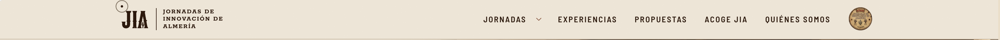

3404 × 138 píxeles. [Abrir original](01-menu.png).

## 02 · hero

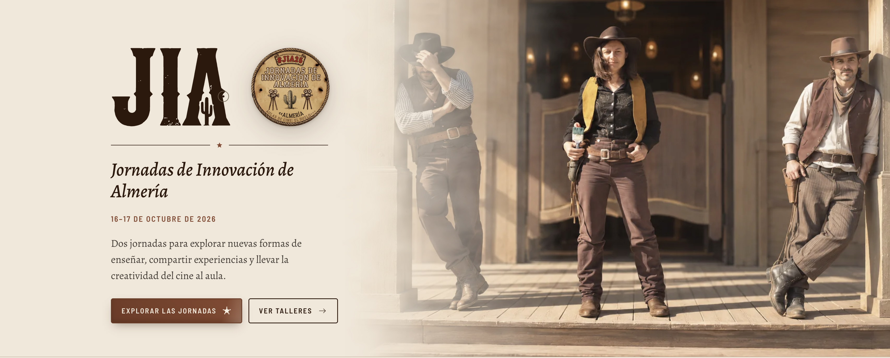

3410 × 1374 píxeles. [Abrir original](02-hero.png).

## 03 · waypoints

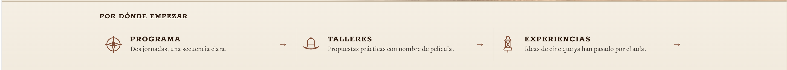

3420 × 306 píxeles. [Abrir original](03-enlaces.png).

## 04 · jornadas

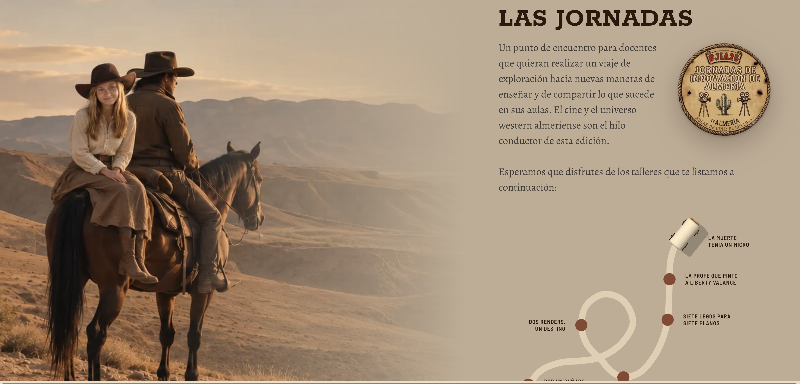

3398 × 1634 píxeles. [Abrir original](04-jornadas.png).

## 05 · video

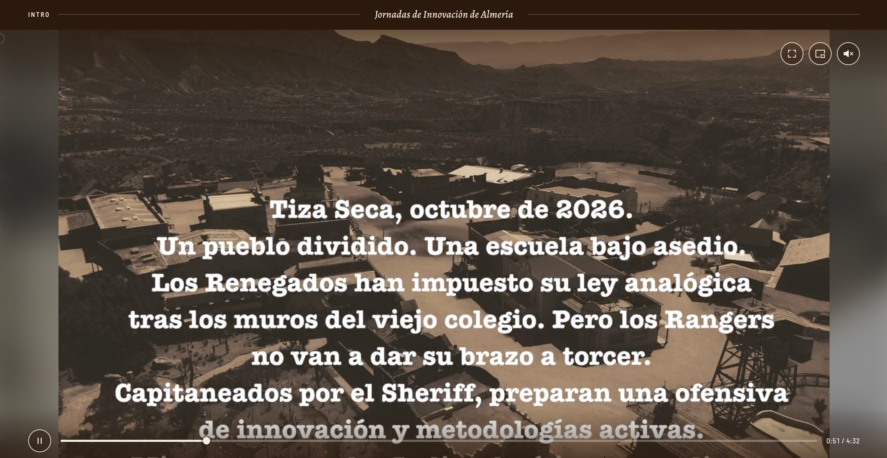

3398 × 1758 píxeles. [Abrir original](05-video.png).

## 06 · program

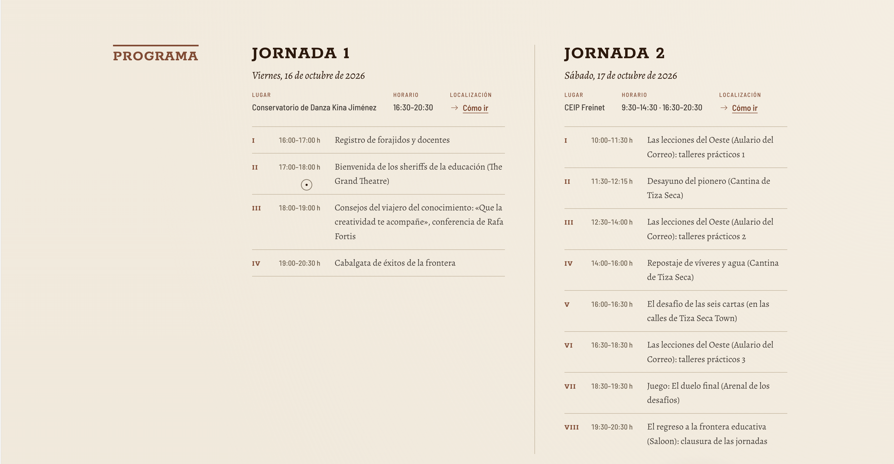

3394 × 1762 píxeles. [Abrir original](06-programa.png).

## 07 · cube

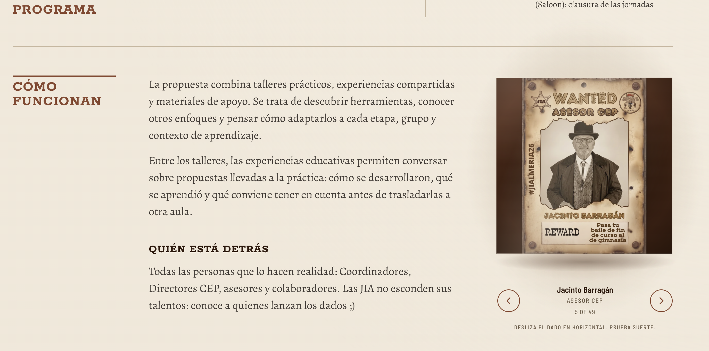

2750 × 1362 píxeles. [Abrir original](07-cubo.png).

## 08 · cards

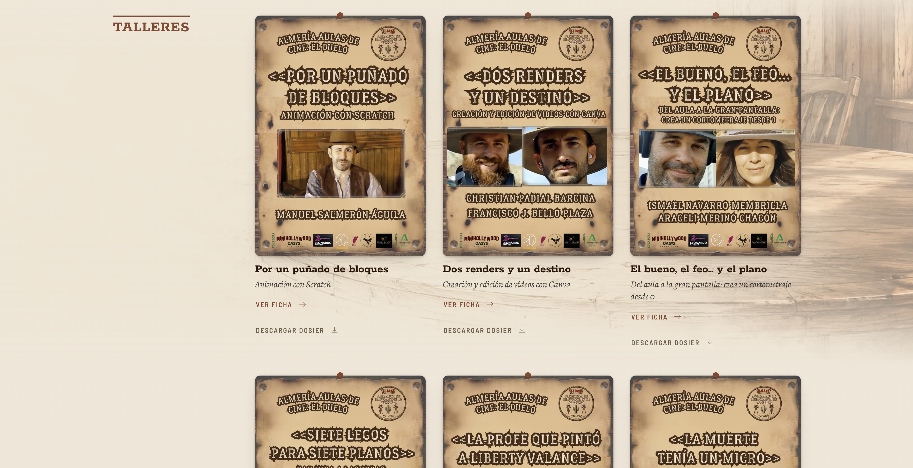

3398 × 1746 píxeles. [Abrir original](08-tarjetas.png).

## 09 · cards-hover

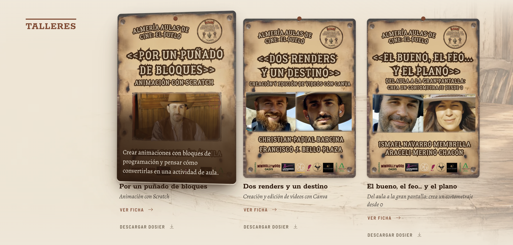

2894 × 1382 píxeles. [Abrir original](09-tarjetas-hover.png).

## 10 · cards-dialog

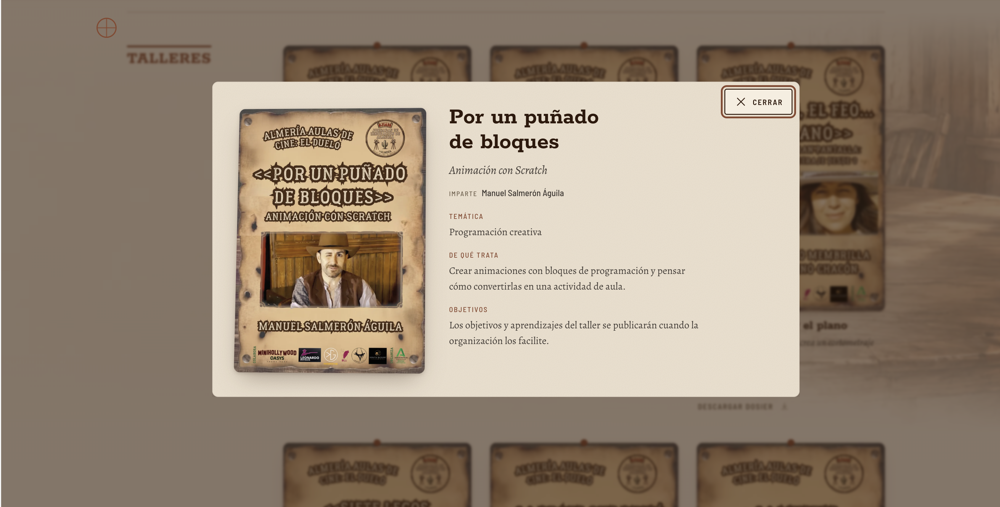

3378 × 1714 píxeles. [Abrir original](10-ficha-modal.png).

## 11 · experiences

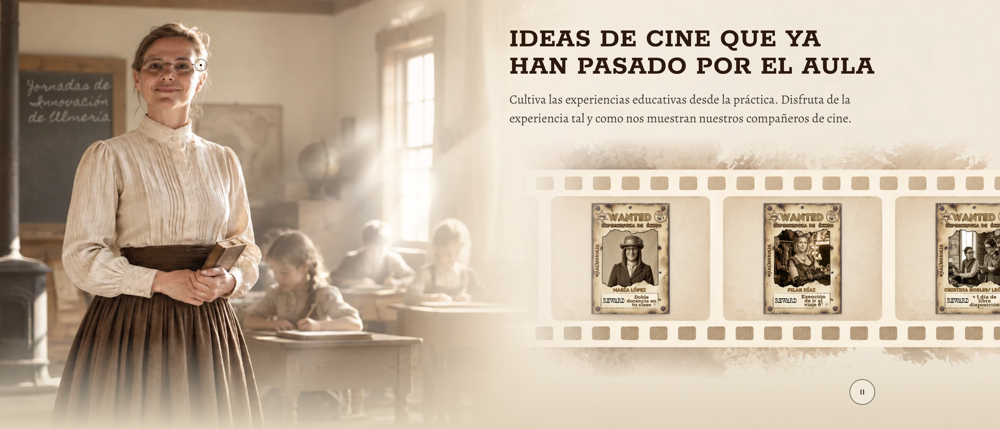

3406 × 1462 píxeles. [Abrir original](11-experiencias-film.png).

## 12 · split-hard

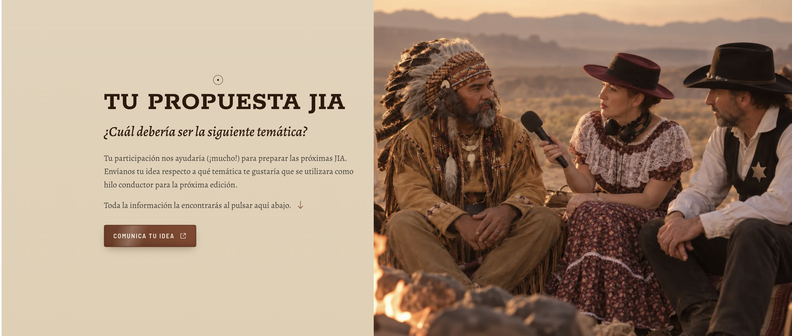

3414 × 1454 píxeles. [Abrir original](12-propuestas-corte-recto.png).

## 13 · partners

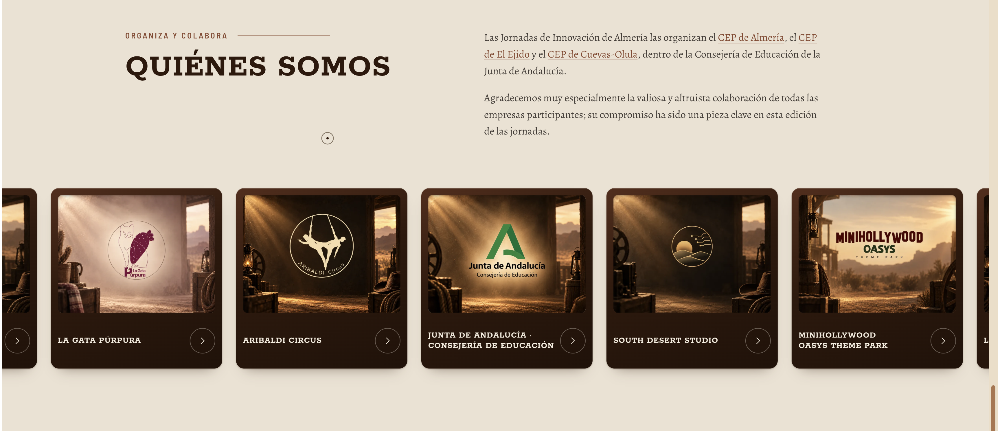

3456 × 1490 píxeles. [Abrir original](13-quienes-somos.png).

## 14 · footer

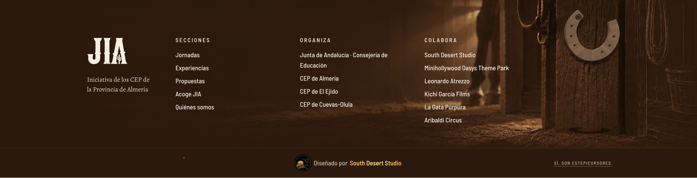

3404 × 874 píxeles. [Abrir original](14-footer.png).
